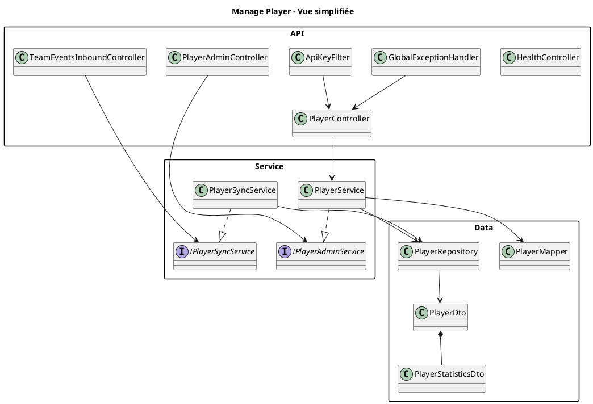

# Diagramme de Classes

Ce diagramme représente les principales classes du module `manage-player`.

Il se concentre sur les éléments utiles pour comprendre le service pendant une présentation :

- controllers HTTP ;
- endpoints d'événements entrants ;
- services et interfaces ;
- repository JDBC ;
- mapper ;
- DTO principaux ;
- sécurité et gestion des erreurs ;
- configuration.

Le fichier source PlantUML est disponible ici :

```text
class-diagram.puml
```

## Lecture du Diagramme

Les dépendances principales suivent ce flux :

```text
Controller / Inbound / Admin
  -> Service
  -> Repository
  -> MariaDB
```

`PlayerController` porte les routes métier `/players`. Il délègue à `PlayerService`, qui applique les validations et règles métier. `PlayerRepository` encapsule l'accès SQL via `JdbcTemplate` et procédures stockées.

`TeamEventsInboundController` représente les événements entrants d'équipe sous forme d'endpoints HTTP. Il délègue à `PlayerSyncService`, qui vérifie l'existence du joueur avant d'ajouter ou retirer l'association équipe.

`GlobalExceptionHandler` standardise les erreurs JSON, tandis que `ApiKeyFilter` protège toutes les routes sauf `/health` et `/error`.

## Vue PlantUML Simplifiée



Pour le diagramme complet avec méthodes et DTO, utiliser `class-diagram.puml`.
